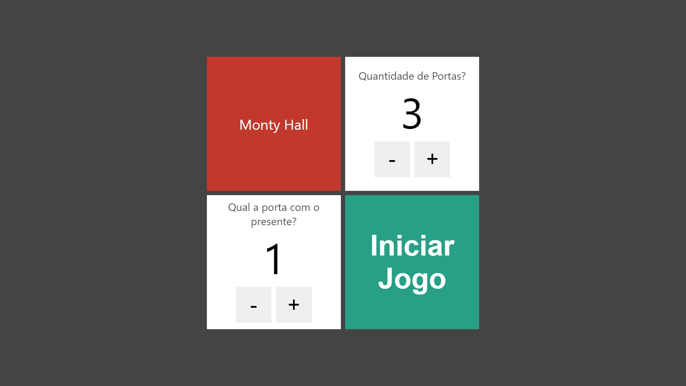
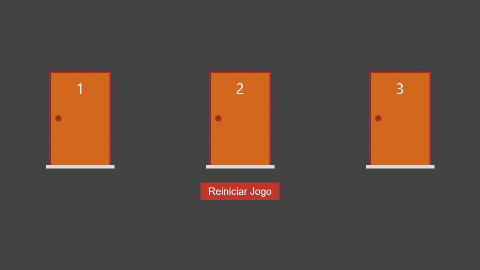
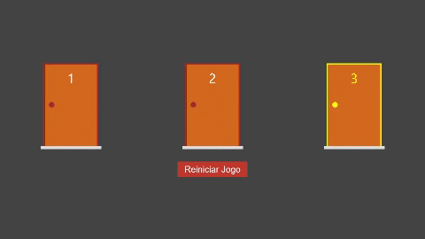
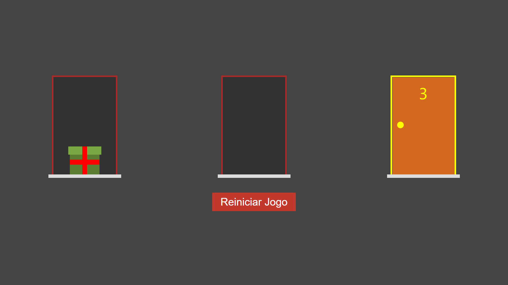

## Problema de Monty Hall

O problema de Monty Hall, também conhecido por paradoxo de Monty Hall é um problema matemático e paradoxo que surgiu a partir de um concurso televisivo dos Estados Unidos chamado Let’s Make a Deal, exibido na década de 1970.

O jogo consistia no seguinte: Monty Hall, o apresentador, apresentava três portas aos concorrentes. Atrás de uma delas estava um prêmio (um carro) e, atrás das outras duas, dois bodes.

Na 1.ª etapa o concorrente escolhe uma das três portas (que ainda não é aberta);

Na 2.ª etapa, Monty abre uma das outras duas portas que o concorrente não escolheu, revelando que o carro não se encontra nessa porta e revelando um dos bodes;

Na 3.ª etapa Monty pergunta ao concorrente se quer decidir permanecer com a porta que escolheu no início do jogo ou se ele pretende mudar para a outra porta que ainda está fechada para então a abrir. Agora, com duas portas apenas para escolher — pois uma delas já se viu, na 2.ª etapa, que não tinha o prêmio — e sabendo que o carro está atrás de uma das restantes duas, o concorrente tem que tomar a decisão.

Nesse jogo: Atrás da porta premiada está uma caixa de presente e atrás das outras, nada.

Na 1.ª etapa deve ser selecionado a quantidade de portas e qual a porta com o presente?



Na 2.ª etapa deve ser escolhida uma das portas, para isso, clique na porta escolhida



Na 3.ª etapa deve ser aberta uma porta que não tem o presente, para isso, clique na maçaneta da porta



Na 4.ª etapa deve decidir se permanece com a porta que escolheu no início do jogo ou se pretende mudar para a outra porta que ainda está fechada, para mudar de porta, clique na porta que deseja.
Obs.: Se houver mais de duas portas fechadas, repita as etapas 3 e 4.

Por último abra a porta premiada



## 🛠️ Technologies

<ul>
  <li><a href="https://git-scm.com/">Git</a></li>
  <li><a href="https://reactjs.org/">React</a></li>
  <li><a href="https://nextjs.org//">Next.js</a></li>
  <li><a href="https://nextjs.org/docs/api-reference/create-next-app/">Create Next App</a></li>
  <li><a href="https://www.typescriptlang.org/">TypeScript</a></li>
  <li><a href="https://www.typescriptlang.org/docs/handbook/jsx.html">TSX</a></li>
  <li><a href="https://www.w3schools.com/css/">CSS3</a></li>
</ul>

## 💾 Installation

```
npm install
# or
yarn
```

## 🚀 Launch

First, run the development server:

```bash
npm run dev
# or
yarn dev
```

Open [http://localhost:3000](http://localhost:3000) with your browser to see the result.

## 📑 License

Project is licensed under the MIT license.
See the <a href="LICENSE">`LICENSE`</a> file for more details.

## ⌨️ Author

Bruno Silva Santana - <ibrunoss@outlook.com> | <https://github.com/ibrunoss>
